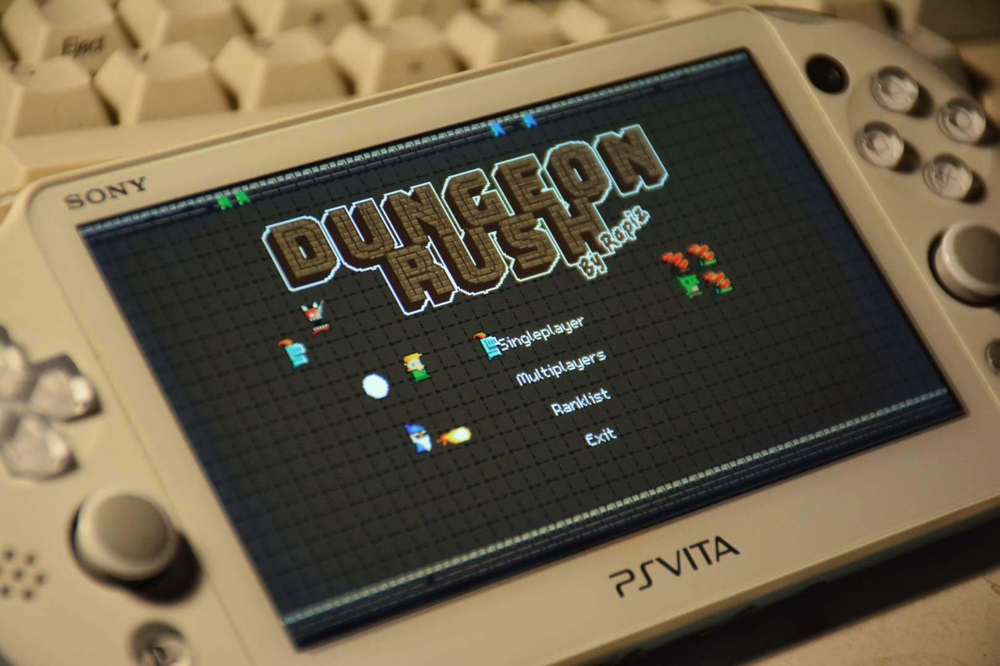

# DungeonRush-PSV

the original code is from [Rapiz1/DungeonRush](https://github.com/Rapiz1/DungeonRush/)




## How to Play

### Singleplayer

Use UP DOWN LEFT RIGHT to move.

Collect heros to enlarge your army while defending yourself from the monsters. Each level has a target length of the hero queue. Once it's reached, you will be sent to the next level and start over. There are lots of stuff that will be adjusted according to the level you're on, including factors of HP and damage, duration of buffs and debuffs, the number and strength of monsters and so on.

### Multiplayers

Player 1 Use UP DOWN LEFT RIGHT to move.

Player 2 Use TRIANGLE CROSS SQUARE CIRCLE to move.

This mode is competitive. Defend yourself from the monsters and your friend!

### Weapons

There are powerful weapons randomly dropped by the monsters. Different kinds of heros can be equipped with different kind of weapons.


### Buff/Debuff

There's a possibility that the attack from one with weapon triggers certain buff on himself or debuff on the enemey.

- IceSword can frozen enemeys.
- HolySword can give you a shield that absorbs damage and makes you immune to debuff.
- GreatBow can increase the damage of all your heros' attack.
- And so on.

For sure, some kinds of monsters have weapons that can put a debuff on you! *(Like the troublesome muddy monsters can slow down your movement.)*


## Compilation

**You should make sure vitasdk are installed before compiling**

```
cmake -B build .
cd build && make
```

## TODO

Make SDL_RenderCopyEx works on PSV

Add Setting View
